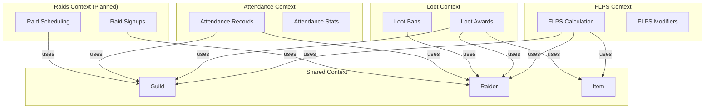
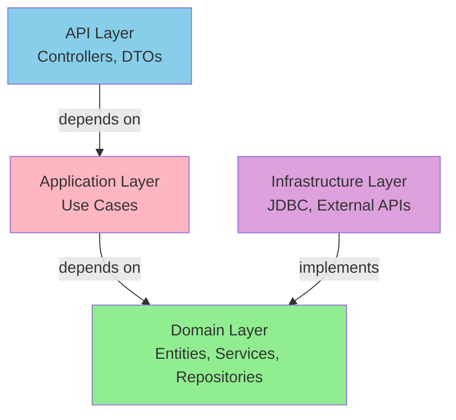
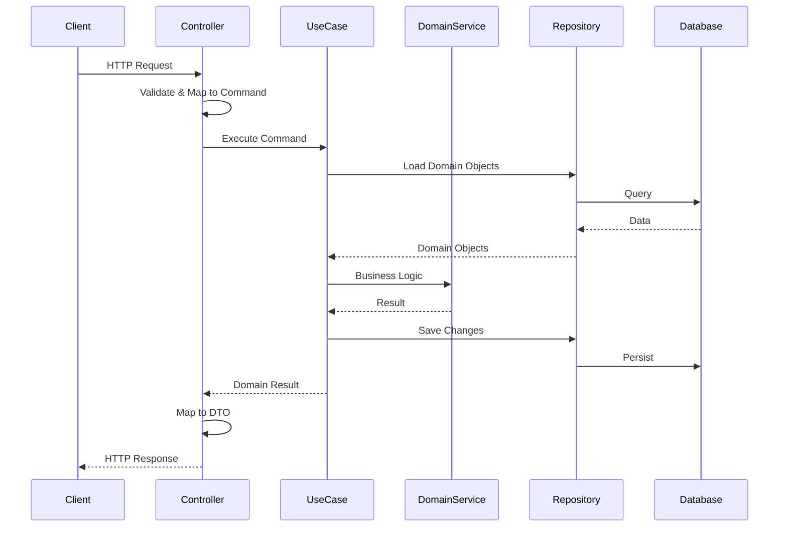

# Code Architecture & Navigation Guide

## 🏗️ System Architecture Overview

EdgeRush LootMan follows a **Domain-Driven Design (DDD) architecture** with clear bounded contexts and layered separation. The system is organized into two main packages:

- **`datasync`**: Legacy package containing configuration, security, and shared infrastructure
- **`lootman`**: New domain-driven package with clean architecture and bounded contexts

### Clean Architecture Layers

```
┌─────────────────────────────────────────────────────────────┐
│                     API Layer (REST)                        │
│  ┌──────────────┐  ┌──────────────┐  ┌──────────────┐     │
│  │ REST         │  │ DTOs         │  │ Exception    │     │
│  │ Controllers  │  │ (Request/    │  │ Handlers     │     │
│  │              │  │  Response)   │  │              │     │
│  └──────────────┘  └──────────────┘  └──────────────┘     │
└────────────────────────┬────────────────────────────────────┘
                         │
┌────────────────────────▼────────────────────────────────────┐
│              Application Layer (Use Cases)                   │
│  ┌──────────────────────────────────────────────────────┐  │
│  │  Bounded Context Use Cases                           │  │
│  │  - FLPS Calculation Use Cases                        │  │
│  │  - Loot Distribution Use Cases                       │  │
│  │  - Attendance Tracking Use Cases                     │  │
│  │  - Raid Management Use Cases (planned)               │  │
│  └──────────────────────────────────────────────────────┘  │
└────────────────────────┬────────────────────────────────────┘
                         │
┌────────────────────────▼────────────────────────────────────┐
│                   Domain Layer                               │
│  ┌──────────────────────────────────────────────────────┐  │
│  │  Domain Models & Business Logic                      │  │
│  │  - Entities, Value Objects, Aggregates               │  │
│  │  - Domain Services                                    │  │
│  │  - Repository Interfaces                             │  │
│  │  - Domain Exceptions                                  │  │
│  └──────────────────────────────────────────────────────┘  │
└────────────────────────┬────────────────────────────────────┘
                         │
┌────────────────────────▼────────────────────────────────────┐
│              Infrastructure Layer                            │
│  ┌──────────────────────────────────────────────────────┐  │
│  │  Technical Implementations                           │  │
│  │  - Repository Implementations (JDBC, In-Memory)      │  │
│  │  - External API Clients (WoWAudit, Warcraft Logs)   │  │
│  │  - PostgreSQL Database                               │  │
│  │  - Entity Mappers                                    │  │
│  └──────────────────────────────────────────────────────┘  │
└─────────────────────────────────────────────────────────────┘
```

### Dependency Rule

Dependencies flow **inward only**:
- **API Layer** → depends on Application Layer
- **Application Layer** → depends on Domain Layer
- **Infrastructure Layer** → implements Domain Layer interfaces
- **Domain Layer** → depends on nothing (pure business logic)

### API Implementation Status

**Current Implementation**: REST API Only

- ✅ **REST API**: Fully implemented with 37 endpoints
  - FLPS calculations and reports
  - Loot distribution and history
  - Attendance tracking
  - Guild management
  - External integrations (WoWAudit, Warcraft Logs)
  - Complete documentation in `API_REFERENCE.md`

- ❌ **GraphQL API**: NOT IMPLEMENTED
  - Planned as Phase 2 of original specification
  - See `.kiro/specs/graphql-tdd-refactor/requirements.md` (Requirements 11-18)
  - Deferred to prioritize core business features
  - REST API provides complete functionality
  - Future implementation timeline: To be determined
  - Complete status analysis: `.kiro/specs/post-refactoring-cleanup/graphql-status.md`

**Note**: All current and planned features (Web Dashboard, Discord Bot) will use the REST API. GraphQL remains a future enhancement that can be added without disrupting existing functionality.

## 🎯 Bounded Contexts

The system is organized into the following bounded contexts within the `lootman` package:

### Implemented Contexts

1. **FLPS** (`lootman.domain.flps`)
   - Final Loot Priority Score calculation
   - FLPS modifiers and configuration
   - Score components (RMS, IPI, RDF)

2. **Loot** (`lootman.domain.loot`)
   - Loot distribution and awards
   - Loot bans and restrictions
   - Loot history tracking

3. **Attendance** (`lootman.domain.attendance`)
   - Raid attendance tracking
   - Attendance reports and statistics
   - Attendance records management

4. **Raids** (`lootman.domain.raids`)
   - Raid scheduling (planned)
   - Raid signups (planned)
   - Raid results (planned)

5. **Shared** (`lootman.domain.shared`)
   - Cross-cutting domain concepts
   - Value objects: `GuildId`, `RaiderId`, `ItemId`
   - Domain exceptions

## 📦 Package Structure (Domain-Driven Design)

### Two-Package Organization

The codebase is organized into two main packages:

#### 1. `datasync` Package (Legacy/Shared Infrastructure)

Contains configuration, security, and shared infrastructure:

```
com.edgerush.datasync/
├── DataSyncApplication.kt         # Spring Boot entry point
├── config/                        # Configuration classes
│   ├── SyncProperties.kt          # External API configuration
│   ├── WebClientConfig.kt         # HTTP client setup
│   ├── OpenApiConfig.kt           # API documentation
│   ├── RateLimitConfig.kt         # Rate limiting
│   ├── FlpsConfigProperties.kt    # FLPS configuration
│   ├── WoWAuditProperties.kt      # WoWAudit settings
│   └── warcraftlogs/              # Warcraft Logs config
└── security/                      # Security infrastructure
    ├── SecurityConfig.kt          # Spring Security setup
    ├── JwtService.kt              # JWT token handling
    ├── JwtAuthenticationFilter.kt # Authentication filter
    ├── AuthenticatedUser.kt       # User context
    └── AdminModeConfig.kt         # Admin mode settings
```

#### 2. `lootman` Package (Domain-Driven Design)

Contains all business logic organized by bounded contexts:

```
com.edgerush.lootman/
├── api/                           # API Layer (REST endpoints)
│   ├── common/                    # Shared API components
│   │   ├── GlobalExceptionHandler.kt
│   │   └── ApiResponse.kt
│   ├── flps/                      # FLPS endpoints
│   │   ├── FlpsController.kt
│   │   └── FlpsDto.kt
│   ├── loot/                      # Loot endpoints
│   │   ├── LootController.kt
│   │   └── LootDto.kt
│   └── attendance/                # Attendance endpoints
│       ├── AttendanceController.kt
│       └── AttendanceDto.kt
│
├── application/                   # Application Layer (Use Cases)
│   ├── flps/                      # FLPS use cases
│   │   ├── CalculateFlpsScoreUseCase.kt
│   │   ├── UpdateModifiersUseCase.kt
│   │   └── GetFlpsReportUseCase.kt
│   ├── loot/                      # Loot use cases
│   │   ├── AwardLootUseCase.kt
│   │   ├── ManageLootBansUseCase.kt
│   │   └── GetLootHistoryUseCase.kt
│   └── attendance/                # Attendance use cases
│       ├── TrackAttendanceUseCase.kt
│       └── GetAttendanceReportUseCase.kt
│
├── domain/                        # Domain Layer (Business Logic)
│   ├── flps/                      # FLPS bounded context
│   │   ├── model/                 # Domain models
│   │   │   ├── FlpsScore.kt
│   │   │   ├── FlpsModifier.kt
│   │   │   └── FlpsModifierId.kt
│   │   ├── service/               # Domain services
│   │   │   └── FlpsCalculationService.kt
│   │   └── repository/            # Repository interfaces
│   │       └── FlpsModifierRepository.kt
│   ├── loot/                      # Loot bounded context
│   │   ├── model/
│   │   │   ├── LootAward.kt
│   │   │   ├── LootBan.kt
│   │   │   ├── LootAwardId.kt
│   │   │   └── LootBanId.kt
│   │   ├── service/
│   │   │   └── LootDistributionService.kt
│   │   └── repository/
│   │       ├── LootAwardRepository.kt
│   │       └── LootBanRepository.kt
│   ├── attendance/                # Attendance bounded context
│   │   ├── model/
│   │   │   ├── AttendanceRecord.kt
│   │   │   ├── AttendanceStats.kt
│   │   │   └── AttendanceRecordId.kt
│   │   ├── service/
│   │   │   └── AttendanceCalculationService.kt
│   │   └── repository/
│   │       └── AttendanceRepository.kt
│   ├── raids/                     # Raids bounded context (planned)
│   │   └── package-info.kt
│   └── shared/                    # Shared domain concepts
│       ├── GuildId.kt             # Value object
│       ├── RaiderId.kt            # Value object
│       ├── ItemId.kt              # Value object
│       └── DomainException.kt     # Base exception
│
└── infrastructure/                # Infrastructure Layer
    ├── flps/                      # FLPS infrastructure
    │   ├── JdbcFlpsModifierRepository.kt
    │   └── InMemoryFlpsModifierRepository.kt
    ├── loot/                      # Loot infrastructure
    │   ├── JdbcLootAwardRepository.kt
    │   └── InMemoryLootBanRepository.kt
    └── attendance/                # Attendance infrastructure
        ├── JdbcAttendanceRepository.kt
        └── InMemoryAttendanceRepository.kt
```

### Layered Architecture Pattern

Each bounded context follows the same layered structure:

```
{context}/
├── model/                         # Domain Layer
│   ├── {Entity}.kt               # Entities with identity
│   ├── {ValueObject}.kt          # Immutable value objects
│   └── {Id}.kt                   # Typed identifiers
├── service/                       # Domain Layer
│   └── {Context}Service.kt       # Domain services
├── repository/                    # Domain Layer (interfaces)
│   └── {Entity}Repository.kt     # Repository contracts
└── (in infrastructure/)           # Infrastructure Layer
    ├── Jdbc{Entity}Repository.kt # JDBC implementations
    └── InMemory{Entity}Repository.kt # In-memory implementations
```

### Domain-Driven Design Patterns Used

#### 1. **Value Objects**
Immutable objects defined by their attributes:
```kotlin
data class GuildId(val value: String) {
    init {
        require(value.isNotBlank()) { "Guild ID cannot be blank" }
    }
}

data class FlpsScore(val value: Double) {
    init {
        require(value in 0.0..1.0) { "FLPS score must be between 0.0 and 1.0" }
    }
}
```

#### 2. **Entities**
Objects with identity and lifecycle:
```kotlin
data class LootAward(
    val id: LootAwardId,
    val guildId: GuildId,
    val raiderId: RaiderId,
    val itemId: ItemId,
    val awardedAt: Instant,
    val flpsScore: FlpsScore
)
```

#### 3. **Aggregates**
Clusters of entities with a root:
```kotlin
// LootAward is an aggregate root
// It controls access to related entities
```

#### 4. **Repository Pattern**
Abstraction for data access:
```kotlin
// Domain layer defines the interface
interface FlpsModifierRepository {
    fun findByGuildId(guildId: GuildId): FlpsModifier?
    fun save(modifier: FlpsModifier): FlpsModifier
}

// Infrastructure layer provides implementations
class JdbcFlpsModifierRepository : FlpsModifierRepository {
    // JDBC implementation
}

class InMemoryFlpsModifierRepository : FlpsModifierRepository {
    // In-memory implementation for testing
}
```

#### 5. **Use Case Pattern**
Single-purpose application services:
```kotlin
@Service
class CalculateFlpsScoreUseCase(
    private val flpsService: FlpsCalculationService,
    private val modifierRepository: FlpsModifierRepository
) {
    fun execute(command: CalculateFlpsCommand): FlpsScore {
        val modifier = modifierRepository.findByGuildId(command.guildId)
        return flpsService.calculate(command.raider, command.item, modifier)
    }
}
```

#### 6. **Domain Services**
Business logic that doesn't fit in entities:
```kotlin
@Service
class FlpsCalculationService {
    fun calculate(
        raider: Raider,
        item: Item,
        modifier: FlpsModifier?
    ): FlpsScore {
        // Complex calculation logic
        val rms = calculateRMS(raider)
        val ipi = calculateIPI(item)
        val rdf = calculateRDF(raider.recentLoot)
        return FlpsScore(rms * ipi * rdf)
    }
}
```

## 📁 Detailed File Structure Guide

### Project Root Structure

```
edgerush-lootman/
├── data-sync-service/             # Main application module
│   ├── src/
│   │   ├── main/
│   │   │   ├── kotlin/com/edgerush/
│   │   │   │   ├── datasync/      # Legacy/shared infrastructure
│   │   │   │   └── lootman/       # Domain-driven design
│   │   │   └── resources/
│   │   │       ├── application.yaml
│   │   │       └── db/migration/  # Flyway migrations
│   │   └── test/                  # Test suite
│   └── build.gradle.kts
├── docs/                          # Documentation
├── deploy/                        # Deployment configs
└── docker-compose.yml             # Local development
```

### Core Application (`data-sync-service/src/main/kotlin/com/edgerush/`)

#### datasync Package (Shared Infrastructure)

```
com.edgerush.datasync/
├── DataSyncApplication.kt          # 🚀 Spring Boot entry point
├── config/                         # ⚙️ Configuration classes
│   ├── SyncProperties.kt           # External API configuration
│   ├── WebClientConfig.kt          # HTTP client setup
│   ├── OpenApiConfig.kt            # Swagger/OpenAPI docs
│   ├── RateLimitConfig.kt          # API rate limiting
│   ├── FlpsConfigProperties.kt     # FLPS configuration
│   ├── WoWAuditProperties.kt       # WoWAudit settings
│   └── warcraftlogs/               # Warcraft Logs config
│       ├── WarcraftLogsProperties.kt
│       └── WarcraftLogsConfig.kt
└── security/                       # 🔒 Security infrastructure
    ├── SecurityConfig.kt           # Spring Security setup
    ├── JwtService.kt               # JWT token handling
    ├── JwtAuthenticationFilter.kt  # Authentication filter
    ├── AuthenticatedUser.kt        # User context
    └── AdminModeConfig.kt          # Admin mode settings
```

#### lootman Package (Domain-Driven Design)

```
com.edgerush.lootman/
├── api/                            # 🌐 API Layer (REST endpoints)
│   ├── common/                     # Shared API components
│   │   ├── GlobalExceptionHandler.kt  # Exception handling
│   │   └── ApiResponse.kt          # Standard response wrapper
│   ├── flps/                       # FLPS endpoints
│   │   ├── FlpsController.kt       # REST controller
│   │   └── FlpsDto.kt              # Request/response DTOs
│   ├── loot/                       # Loot endpoints
│   │   ├── LootController.kt
│   │   └── LootDto.kt
│   └── attendance/                 # Attendance endpoints
│       ├── AttendanceController.kt
│       └── AttendanceDto.kt
│
├── application/                    # 🎯 Application Layer (Use Cases)
│   ├── flps/                       # FLPS use cases
│   │   ├── CalculateFlpsScoreUseCase.kt
│   │   ├── UpdateModifiersUseCase.kt
│   │   └── GetFlpsReportUseCase.kt
│   ├── loot/                       # Loot use cases
│   │   ├── AwardLootUseCase.kt
│   │   ├── ManageLootBansUseCase.kt
│   │   └── GetLootHistoryUseCase.kt
│   └── attendance/                 # Attendance use cases
│       ├── TrackAttendanceUseCase.kt
│       └── GetAttendanceReportUseCase.kt
│
├── domain/                         # 🧠 Domain Layer (Business Logic)
│   ├── flps/                       # FLPS bounded context
│   │   ├── model/
│   │   │   ├── FlpsScore.kt        # Value object
│   │   │   ├── FlpsModifier.kt     # Entity
│   │   │   └── FlpsModifierId.kt   # Typed ID
│   │   ├── service/
│   │   │   └── FlpsCalculationService.kt
│   │   └── repository/
│   │       └── FlpsModifierRepository.kt
│   ├── loot/                       # Loot bounded context
│   │   ├── model/
│   │   │   ├── LootAward.kt        # Aggregate root
│   │   │   ├── LootBan.kt          # Entity
│   │   │   ├── LootAwardId.kt      # Typed ID
│   │   │   └── LootBanId.kt        # Typed ID
│   │   ├── service/
│   │   │   └── LootDistributionService.kt
│   │   └── repository/
│   │       ├── LootAwardRepository.kt
│   │       └── LootBanRepository.kt
│   ├── attendance/                 # Attendance bounded context
│   │   ├── model/
│   │   │   ├── AttendanceRecord.kt
│   │   │   ├── AttendanceStats.kt
│   │   │   └── AttendanceRecordId.kt
│   │   ├── service/
│   │   │   └── AttendanceCalculationService.kt
│   │   └── repository/
│   │       └── AttendanceRepository.kt
│   ├── raids/                      # Raids bounded context (planned)
│   │   └── package-info.kt
│   └── shared/                     # Shared domain concepts
│       ├── GuildId.kt              # Value object
│       ├── RaiderId.kt             # Value object
│       ├── ItemId.kt               # Value object
│       └── DomainException.kt      # Base exception
│
└── infrastructure/                 # 🔧 Infrastructure Layer
    ├── flps/                       # FLPS infrastructure
    │   ├── JdbcFlpsModifierRepository.kt
    │   └── InMemoryFlpsModifierRepository.kt
    ├── loot/                       # Loot infrastructure
    │   ├── JdbcLootAwardRepository.kt
    │   └── InMemoryLootBanRepository.kt
    └── attendance/                 # Attendance infrastructure
        ├── JdbcAttendanceRepository.kt
        └── InMemoryAttendanceRepository.kt
```

### Configuration & Resources (`data-sync-service/src/main/resources/`)

```
resources/
├── application.yaml               # 🔧 Main configuration
├── application-sqlite.yaml       # 🧪 Testing configuration
└── db/migration/postgres/         # 🗃️ Database schema evolution
    ├── V0001__init.sql           # Initial schema
    ├── V0002__wishlist_snapshots.sql
    ├── V0003__wowaudit_snapshots.sql
    ├── V0004__wowaudit_normalized.sql
    ├── V0005__expand_roster.sql
    ├── V0006__expand_applications.sql
    ├── V0007__expand_loot_history.sql
    ├── V0008__expand_raids_attendance_wishlists.sql
    ├── V0009__team_period_metadata.sql
    └── V0010__expand_team_metadata.sql
```

### Testing Structure (`data-sync-service/src/test/kotlin/`)

```
test/kotlin/com/edgerush/datasync/
├── AcceptanceSmokeTest.kt         # 🔍 End-to-end validation
├── api/wowaudit/
│   └── CharacterDeserializerTest.kt
├── client/
│   └── WoWAuditClientTest.kt      # External API mocking
├── config/
│   └── SyncPropertiesTest.kt      # Configuration validation
├── schema/
│   └── WoWAuditSchemaTest.kt      # Data format validation
└── service/
    └── ScoreCalculatorTest.kt     # ⭐ FLPS algorithm tests
```

## 🎯 Key Components Deep Dive

### 1. Domain Layer Components

#### Value Objects (Immutable, Validated)

**GuildId.kt** - Typed identifier for guilds
```kotlin
data class GuildId(val value: String) {
    init {
        require(value.isNotBlank()) { "Guild ID cannot be blank" }
    }
}
```

**FlpsScore.kt** - FLPS calculation result
```kotlin
data class FlpsScore(val value: Double) {
    init {
        require(value in 0.0..1.0) { "FLPS score must be between 0.0 and 1.0" }
    }
}
```

#### Entities (Identity + Lifecycle)

**LootAward.kt** - Aggregate root for loot distribution
```kotlin
data class LootAward(
    val id: LootAwardId,
    val guildId: GuildId,
    val raiderId: RaiderId,
    val itemId: ItemId,
    val awardedAt: Instant,
    val flpsScore: FlpsScore
)
```

**FlpsModifier.kt** - Guild-specific FLPS configuration
```kotlin
data class FlpsModifier(
    val id: FlpsModifierId,
    val guildId: GuildId,
    val attendanceWeight: Double,
    val performanceWeight: Double,
    val preparationWeight: Double
)
```

#### Domain Services (Business Logic)

**FlpsCalculationService.kt** - Core FLPS algorithm
```kotlin
@Service
class FlpsCalculationService {
    fun calculate(
        raider: Raider,
        item: Item,
        modifier: FlpsModifier?
    ): FlpsScore {
        val rms = calculateRMS(raider, modifier)
        val ipi = calculateIPI(item)
        val rdf = calculateRDF(raider.recentLoot)
        return FlpsScore(rms * ipi * rdf)
    }
    
    private fun calculateRMS(raider: Raider, modifier: FlpsModifier?): Double
    private fun calculateIPI(item: Item): Double
    private fun calculateRDF(recentLoot: List<LootAward>): Double
}
```

**Critical Business Rules**:
- RMS caps at 0.0 for critical mechanical failures
- IPI tier set bonuses override individual upgrades
- RDF applies time-based decay factors
- All scores normalized to 0.0-1.0 range

#### Repository Interfaces (Data Access Contracts)

**FlpsModifierRepository.kt** - Domain interface
```kotlin
interface FlpsModifierRepository {
    fun findByGuildId(guildId: GuildId): FlpsModifier?
    fun save(modifier: FlpsModifier): FlpsModifier
    fun delete(id: FlpsModifierId)
}
```

### 2. Application Layer Components

#### Use Cases (Single-Purpose Operations)

**CalculateFlpsScoreUseCase.kt** - FLPS calculation orchestration
```kotlin
@Service
class CalculateFlpsScoreUseCase(
    private val flpsService: FlpsCalculationService,
    private val modifierRepository: FlpsModifierRepository
) {
    fun execute(command: CalculateFlpsCommand): FlpsScore {
        val modifier = modifierRepository.findByGuildId(command.guildId)
        return flpsService.calculate(command.raider, command.item, modifier)
    }
}

data class CalculateFlpsCommand(
    val guildId: GuildId,
    val raider: Raider,
    val item: Item
)
```

**AwardLootUseCase.kt** - Loot distribution orchestration
```kotlin
@Service
class AwardLootUseCase(
    private val lootService: LootDistributionService,
    private val lootAwardRepository: LootAwardRepository,
    private val lootBanRepository: LootBanRepository
) {
    @Transactional
    fun execute(command: AwardLootCommand): Result<LootAward> {
        // Check for active bans
        val activeBan = lootBanRepository.findActiveByRaiderId(command.raiderId)
        if (activeBan != null) {
            return Result.failure(LootBanActiveException(activeBan))
        }
        
        // Create and save award
        val award = lootService.createAward(command)
        return Result.success(lootAwardRepository.save(award))
    }
}
```

### 3. Infrastructure Layer Components

#### Repository Implementations

**JdbcFlpsModifierRepository.kt** - JDBC implementation
```kotlin
@Repository
class JdbcFlpsModifierRepository(
    private val jdbcTemplate: JdbcTemplate
) : FlpsModifierRepository {
    
    override fun findByGuildId(guildId: GuildId): FlpsModifier? {
        return jdbcTemplate.query(
            "SELECT * FROM flps_modifiers WHERE guild_id = ?",
            FlpsModifierRowMapper(),
            guildId.value
        ).firstOrNull()
    }
    
    override fun save(modifier: FlpsModifier): FlpsModifier {
        // JDBC save logic
    }
}
```

**InMemoryFlpsModifierRepository.kt** - Test implementation
```kotlin
class InMemoryFlpsModifierRepository : FlpsModifierRepository {
    private val storage = mutableMapOf<FlpsModifierId, FlpsModifier>()
    
    override fun findByGuildId(guildId: GuildId): FlpsModifier? {
        return storage.values.find { it.guildId == guildId }
    }
    
    override fun save(modifier: FlpsModifier): FlpsModifier {
        storage[modifier.id] = modifier
        return modifier
    }
}
```

### 4. API Layer Components

#### REST Controllers (HTTP Endpoints)

**FlpsController.kt** - FLPS REST API
```kotlin
@RestController
@RequestMapping("/api/flps")
class FlpsController(
    private val calculateFlpsUseCase: CalculateFlpsScoreUseCase,
    private val updateModifiersUseCase: UpdateModifiersUseCase
) {
    @PostMapping("/calculate")
    fun calculateScore(@RequestBody request: CalculateFlpsRequest): FlpsResponse {
        val command = request.toCommand()
        val score = calculateFlpsUseCase.execute(command)
        return FlpsResponse.from(score)
    }
    
    @PutMapping("/modifiers/{guildId}")
    fun updateModifiers(
        @PathVariable guildId: String,
        @RequestBody request: UpdateModifiersRequest
    ): ModifierResponse {
        val command = request.toCommand(GuildId(guildId))
        val modifier = updateModifiersUseCase.execute(command)
        return ModifierResponse.from(modifier)
    }
}
```

#### DTOs (Data Transfer Objects)

**FlpsDto.kt** - Request/response models
```kotlin
data class CalculateFlpsRequest(
    val guildId: String,
    val raiderId: String,
    val itemId: String
) {
    fun toCommand() = CalculateFlpsCommand(
        guildId = GuildId(guildId),
        raider = Raider(RaiderId(raiderId)),
        item = Item(ItemId(itemId))
    )
}

data class FlpsResponse(
    val score: Double,
    val breakdown: ScoreBreakdown
) {
    companion object {
        fun from(score: FlpsScore) = FlpsResponse(
            score = score.value,
            breakdown = ScoreBreakdown(/* ... */)
        )
    }
}
```

#### Exception Handling

**GlobalExceptionHandler.kt** - Centralized error handling
```kotlin
@RestControllerAdvice
class GlobalExceptionHandler {
    
    @ExceptionHandler(DomainException::class)
    fun handleDomainException(ex: DomainException): ResponseEntity<ErrorResponse> {
        return ResponseEntity
            .status(HttpStatus.BAD_REQUEST)
            .body(ErrorResponse(ex.message))
    }
    
    @ExceptionHandler(EntityNotFoundException::class)
    fun handleNotFound(ex: EntityNotFoundException): ResponseEntity<ErrorResponse> {
        return ResponseEntity
            .status(HttpStatus.NOT_FOUND)
            .body(ErrorResponse(ex.message))
    }
}
```

## 📊 Architecture Diagrams

### Bounded Context Map



### Layer Dependencies



### Request Flow



## 🔄 Data Flow Architecture

### 1. FLPS Calculation Flow

```
REST Request → FlpsController → CalculateFlpsScoreUseCase
                                        ↓
                        FlpsCalculationService (Domain Service)
                                        ↓
                    ┌──────────────────┴──────────────────┐
                    ↓                  ↓                   ↓
            Calculate RMS      Calculate IPI      Calculate RDF
         (Merit Score)      (Priority Index)    (Decay Factor)
                    ↓                  ↓                   ↓
                    └──────────────────┬──────────────────┘
                                       ↓
                            FlpsScore (Value Object)
                                       ↓
                            FlpsModifierRepository
                                       ↓
                                   Database
```

### 2. Loot Award Flow

```
REST Request → LootController → AwardLootUseCase
                                      ↓
                        LootDistributionService (Domain Service)
                                      ↓
                    ┌─────────────────┴─────────────────┐
                    ↓                                    ↓
        Check LootBan Status                  Create LootAward
                    ↓                                    ↓
        LootBanRepository                    LootAwardRepository
                    ↓                                    ↓
                Database                             Database
```

### 3. Repository Pattern Flow

```
Use Case → Repository Interface (Domain Layer)
                    ↓
        Repository Implementation (Infrastructure Layer)
                    ↓
            ┌───────┴───────┐
            ↓               ↓
    JdbcRepository    InMemoryRepository
            ↓               ↓
        Database        In-Memory Map
```

### 4. Cross-Context Communication

```
FLPS Context ──────────────────────────────────┐
    ↓                                          ↓
Uses Shared Value Objects              Publishes Domain Events
    ↓                                          ↓
GuildId, RaiderId, ItemId              Event Bus (Future)
    ↑                                          ↓
    └──────────────────────────────────────────┘
                    ↑
            Loot Context, Attendance Context
```

## 🧩 Module Dependencies

### Core Dependencies
```kotlin
// Spring Boot ecosystem
implementation("org.springframework.boot:spring-boot-starter-webflux")
implementation("org.springframework.boot:spring-boot-starter-data-jdbc")
implementation("org.springframework.boot:spring-boot-starter-actuator")

// Database & migrations
implementation("org.flywaydb:flyway-core")
runtimeOnly("org.postgresql:postgresql")

// Kotlin & coroutines
implementation("org.jetbrains.kotlinx:kotlinx-coroutines-reactor")
implementation("io.projectreactor.kotlin:reactor-kotlin-extensions")

// Resilience & monitoring
implementation("io.github.resilience4j:resilience4j-spring-boot3")
```

### Development Dependencies
```kotlin
// Testing framework
testImplementation("org.springframework.boot:spring-boot-starter-test")
testImplementation("io.projectreactor:reactor-test")
testImplementation("com.squareup.okhttp3:mockwebserver")
```

## 🎛️ Configuration Management

### Environment Variables
```yaml
# Database connection
POSTGRES_HOST: postgres
POSTGRES_PORT: 5432
POSTGRES_DB: edgerush
POSTGRES_USER: edgerush
POSTGRES_PASSWORD: edgerush

# External APIs
WOWAUDIT_API_KEY: ${api_key}
WOWAUDIT_GUILD_URI: ${guild_url}
WARCRAFT_LOGS_CLIENT_ID: ${client_id}
RAIDBOTS_API_KEY: ${api_key}

# Application behavior
SYNC_RUN_ON_STARTUP: true
SPRING_PROFILES_ACTIVE: default
```

### Spring Profiles
- **default**: PostgreSQL with full external API integration
- **sqlite**: Local testing with file-based database
- **test**: Mock external services for unit testing

## 🚀 Deployment Architecture

### Docker Compose Stack
```yaml
services:
  postgres:    # PostgreSQL 18 database
  data-sync:   # Spring Boot app (custom JDK 24 image)
  nginx:       # Reverse proxy for API access
```

### Container Communication
- **Internal network**: Services communicate via container names
- **Volume mounting**: Source code for development
- **Port mapping**: 80 (nginx) → 8080 (app) → 5432 (db)

## 📊 Monitoring & Observability

### Health Checks
- **Application**: `/actuator/health`
- **Database**: Connection pool metrics
- **External APIs**: Circuit breaker status

### Logging Strategy
- **Structured logging**: JSON format for parsing
- **Log levels**: DEBUG for development, INFO for production
- **Correlation IDs**: Track requests across services

## 🧪 Testing Architecture

### Test Structure

```
test/kotlin/com/edgerush/
├── datasync/                      # Infrastructure tests
│   ├── config/
│   │   └── TestSecurityConfig.kt  # Test security setup
│   └── test/
│       └── base/
│           └── IntegrationTest.kt # Base integration test
│
└── lootman/                       # Domain tests
    ├── domain/                    # Domain layer tests
    │   ├── flps/
    │   │   ├── model/
    │   │   │   └── FlpsScoreTest.kt
    │   │   └── service/
    │   │       └── FlpsCalculationServiceTest.kt
    │   └── loot/
    │       └── model/
    │           └── LootAwardTest.kt
    │
    ├── application/               # Use case tests
    │   ├── flps/
    │   │   └── CalculateFlpsScoreUseCaseTest.kt
    │   └── loot/
    │       └── AwardLootUseCaseTest.kt
    │
    ├── infrastructure/            # Infrastructure tests
    │   ├── flps/
    │   │   └── JdbcFlpsModifierRepositoryTest.kt
    │   └── loot/
    │       └── JdbcLootAwardRepositoryTest.kt
    │
    └── api/                       # API integration tests
        ├── flps/
        │   └── FlpsControllerTest.kt
        └── loot/
            └── LootControllerTest.kt
```

### Testing Patterns by Layer

#### Domain Layer Tests (Pure Unit Tests)

```kotlin
class FlpsScoreTest {
    @Test
    fun `should validate score is between 0 and 1`() {
        assertThrows<IllegalArgumentException> {
            FlpsScore(-0.1)
        }
        assertThrows<IllegalArgumentException> {
            FlpsScore(1.1)
        }
    }
}

class FlpsCalculationServiceTest {
    private val service = FlpsCalculationService()
    
    @Test
    fun `should calculate FLPS score correctly`() {
        val raider = createTestRaider()
        val item = createTestItem()
        val modifier = createTestModifier()
        
        val score = service.calculate(raider, item, modifier)
        
        assertThat(score.value).isBetween(0.0, 1.0)
    }
}
```

#### Application Layer Tests (Use Case Tests)

```kotlin
class CalculateFlpsScoreUseCaseTest {
    private val flpsService = mock<FlpsCalculationService>()
    private val modifierRepository = mock<FlpsModifierRepository>()
    private val useCase = CalculateFlpsScoreUseCase(flpsService, modifierRepository)
    
    @Test
    fun `should calculate score using guild modifier`() {
        val guildId = GuildId("test-guild")
        val modifier = createTestModifier(guildId)
        whenever(modifierRepository.findByGuildId(guildId)).thenReturn(modifier)
        
        val command = CalculateFlpsCommand(guildId, raider, item)
        val result = useCase.execute(command)
        
        verify(flpsService).calculate(raider, item, modifier)
    }
}
```

#### Infrastructure Layer Tests (Integration Tests)

```kotlin
@SpringBootTest
@Transactional
class JdbcFlpsModifierRepositoryTest {
    @Autowired
    private lateinit var repository: FlpsModifierRepository
    
    @Test
    fun `should save and retrieve modifier`() {
        val modifier = createTestModifier()
        
        val saved = repository.save(modifier)
        val retrieved = repository.findByGuildId(modifier.guildId)
        
        assertThat(retrieved).isEqualTo(saved)
    }
}
```

#### API Layer Tests (Integration Tests)

```kotlin
@SpringBootTest(webEnvironment = SpringBootTest.WebEnvironment.RANDOM_PORT)
class FlpsControllerTest {
    @Autowired
    private lateinit var restTemplate: TestRestTemplate
    
    @Test
    fun `should calculate FLPS score via REST API`() {
        val request = CalculateFlpsRequest(
            guildId = "test-guild",
            raiderId = "test-raider",
            itemId = "test-item"
        )
        
        val response = restTemplate.postForEntity(
            "/api/flps/calculate",
            request,
            FlpsResponse::class.java
        )
        
        assertThat(response.statusCode).isEqualTo(HttpStatus.OK)
        assertThat(response.body?.score).isBetween(0.0, 1.0)
    }
}
```

### Test Coverage Goals

- **Domain Layer**: ≥90% coverage (pure business logic)
- **Application Layer**: ≥85% coverage (use case orchestration)
- **Infrastructure Layer**: ≥80% coverage (technical implementations)
- **API Layer**: ≥85% coverage (endpoint integration)
- **Overall**: ≥85% coverage

### Test Database Configuration

```yaml
# application-test.yaml
spring:
  datasource:
    url: jdbc:postgresql://localhost:5432/edgerush_test
    username: edgerush
    password: edgerush
  flyway:
    clean-disabled: false  # Allow clean for tests
```

---

## 🎯 AI Agent Navigation Tips

### Starting Points for Common Tasks

#### Adding New Feature
1. **Design**: Create spec in `.kiro/specs/{feature-name}/`
2. **Domain**: Start with domain models in `lootman/domain/{context}/model/`
3. **Repository**: Define interface in `domain/{context}/repository/`
4. **Use Case**: Implement in `application/{context}/`
5. **Infrastructure**: Implement repository in `infrastructure/{context}/`
6. **API**: Add controller in `api/{context}/`
7. **Tests**: Add tests at each layer

#### Modifying FLPS Algorithm
1. Start with `FlpsCalculationServiceTest.kt` (write failing test)
2. Update `FlpsCalculationService.kt` (implement change)
3. Verify `CalculateFlpsScoreUseCaseTest.kt` still passes
4. Update `FlpsControllerTest.kt` if API changes
5. Update documentation in `docs/score-model.md`

#### Adding New Bounded Context
1. Create package structure: `domain/{context}/`, `application/{context}/`, etc.
2. Define domain models in `domain/{context}/model/`
3. Define repository interfaces in `domain/{context}/repository/`
4. Implement use cases in `application/{context}/`
5. Implement repositories in `infrastructure/{context}/`
6. Add REST controllers in `api/{context}/`
7. Add comprehensive tests

#### Database Schema Changes
1. Create new migration: `V{next}__description.sql`
2. Update domain models if needed
3. Update repository implementations
4. Run `./gradlew flywayMigrate` to apply
5. Verify tests still pass

#### Adding External API Integration
1. Define domain interface in `domain/{context}/`
2. Implement client in `infrastructure/external/{api}/`
3. Add configuration in `datasync/config/`
4. Add retry and circuit breaker patterns
5. Add comprehensive error handling
6. Create integration tests with MockWebServer

### Code Quality Indicators

- **Test Coverage**: ≥85% overall, ≥90% on domain layer
- **Documentation**: KDoc on all public APIs
- **Error Handling**: All external calls use `Result<T>` or try-catch
- **Performance**: Database queries optimized with indexes
- **Security**: API keys in environment variables, never hardcoded
- **Immutability**: Value objects are immutable data classes
- **Validation**: Input validation at domain boundaries
- **Separation**: No business logic in controllers or repositories

### Architecture Principles to Follow

1. **Dependency Rule**: Dependencies point inward (API → Application → Domain ← Infrastructure)
2. **Single Responsibility**: Each class has one reason to change
3. **Interface Segregation**: Repository interfaces are focused and minimal
4. **Dependency Inversion**: Depend on abstractions (interfaces), not implementations
5. **Domain Purity**: Domain layer has no framework dependencies
6. **Bounded Contexts**: Clear boundaries between different business areas
7. **Ubiquitous Language**: Use domain terminology consistently
8. **Aggregate Boundaries**: Enforce consistency within aggregates
9. **Repository Pattern**: Abstract data access behind interfaces
10. **Use Case Pattern**: One use case per business operation